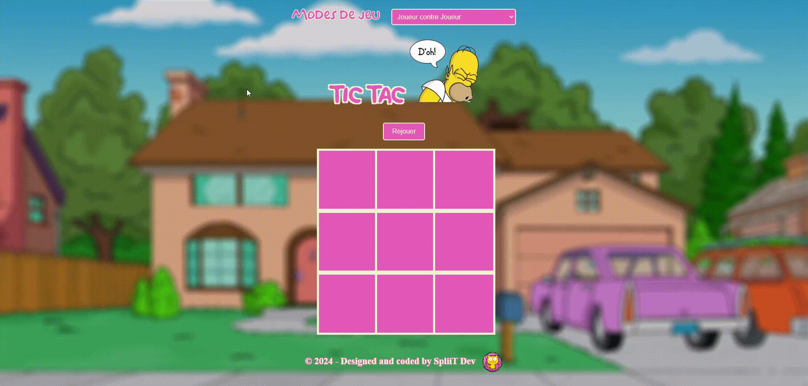
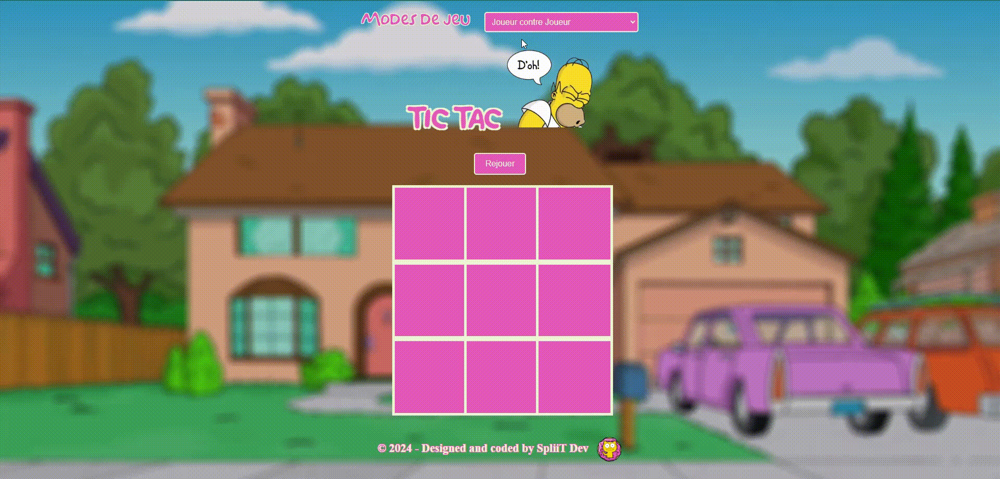

# Tic Tac Doh

## Description

Tic Tac D'oh! est une version du célèbre jeu du "Morpion" sous le thème des Simpsons. Ce jeu a été réalisé dans le cadre d'un projet pour La Fabrique Numérique.

## Fonctionnalités

- Gameplay classique du Tic Tac Toe.
- Design responsive pour une expérience fluide sur différents appareils.

## Technologies Utilisées

- HTML5
- CSS3
- JavaScript

## Installation

1. Clonez le dépôt : `git clone https://github.com/SpliiT/tic-tac-doh.git`
2. Ouvrez le fichier `index.html` dans votre navigateur web préféré à l'aide d'un serveur local.

Vous pouvez également jouer directement en ligne via ce lien : https://morpion-simpsons.netlify.app/

## Utilisation

- Lancez le jeu dans votre navigateur.
- Jouez au Tic Tac D'oh! avec un ami, contre un bot (un peu nul) ou contre un bot entrainé et amusez-vous !

## Gameplay / Modes de jeu

Ce jeu contient 3 modes : 

• Joueur contre Joueur

• Joueur contre Ordinateur (Random)

• Joueur contre Ordinateur (Pro)

## Victoires

## Match nul
