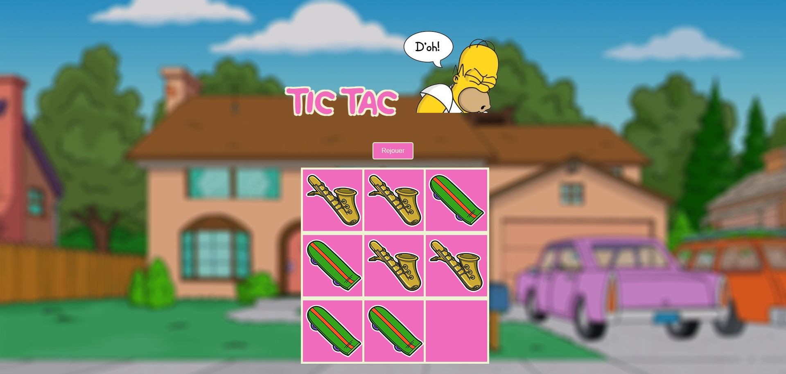

# Tic Tac Doh

## Description

Tic Tac Doh est une version du célèbre jeu du "Morpion" sous le thème des Simpsons. Ce jeu a été réalisé dans le cadre d'un projet pour La Fabrique Numérique.

## Fonctionnalités

- Gameplay classique du Tic Tac Toe.
- Design responsive pour une expérience fluide sur différents appareils.

## Technologies Utilisées

- HTML5
- CSS3
- JavaScript

## Installation

1. Clonez le dépôt : `git clone https://github.com/votre-nom-utilisateur/tic-tac-doh.git`
2. Ouvrez le fichier `index.html` dans votre navigateur web préféré.

## Utilisation

- Lancez le jeu dans votre navigateur.
- Jouez au Tic Tac Toe avec un ami et amusez-vous !

## Gameplay

## Victoires

## Match nul
